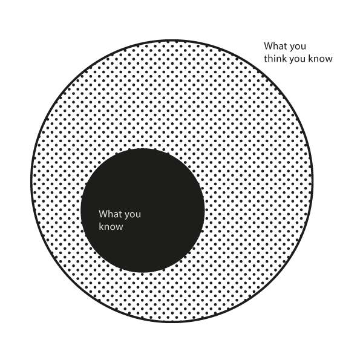

# 掌握成功：在你的能力圈内导航

了解你在哪些方面有优势，哪些方面没有，可以帮助你预防问题，发现别人错过的机会，并迅速学习。

我们都有一个能力圈——我们拥有大量知识的领域。

能力圈的大小并不重要。重要的是知道你何时接近边界。

在你的能力圈内，你操作时具有优势。当你接近边界（你的知识限制）时，你的优势开始减少。当你越过边界时，不仅你的优势消失了，而且转移到了其他人身上。突然之间，你发现自己在一个别人有优势的领域里玩耍。

仅仅因为你擅长某事，并不意味着你擅长一切。

国际象棋大师在棋盘上如鱼得水，但这些技能并不转化为生活中的其他领域的能力，比如厨房里的烹饪。实际上，通常情况下，在一个领域的极端技能会在其他领域造成极端的弱点。

> 我想关注那些我比其他人有优势的事情。我不想参与别人比我有优势的游戏。我不参与其他人聪明而我愚蠢的游戏。我寻找一个我聪明而他们愚蠢的游戏。相信我，这样做效果更好。上帝保佑我们愚蠢的竞争对手。他们让我们富有。

> 查理·芒格

当我们从我们所知道的领域越过边界到我们不知道的领域时，自信不会像能力那样快速减少。在能力圈外操作的最大风险是你看不到的东西。

虽然大多数人关心他们的能力圈的大小，但更重要的是知道你何时接近边界。

## 能力圈

> 我不是天才。我在某些地方很聪明——但我只在那些地方待着。
> IBM的创始人汤姆·沃森

沃伦·巴菲特用他的一位前业务经理罗斯·布卢姆金描述能力圈，她是一位英语不佳的俄罗斯移民，她在内布拉斯加建立了最大的家具店：

> 我不能在买下这个生意时给她价值2亿美元的伯克希尔·哈撒韦股票，因为她不懂股票。她懂现金。她懂家具。她懂房地产。她不懂股票，所以她不涉及它们。如果你在布卢姆金夫人的能力圈内与她打交道……如果价格合适，她今天下午会买5000张边桌。她会买20种不同的地毯，以及其他类似的东西[打响指]，因为她懂地毯。即使通用汽车的股票每股50美分，她也不会买100股。

布卢姆金夫人的能力圈如此狭窄，并没有伤害到她。事实上，人们可以说恰恰相反。她对该领域的严格奉献使她能够专注。只有专注于一件事，她才能克服自己的障碍并取得如此巨大的成功。

查理·芒格将这一概念应用到生活中。他试图回答一个基本问题：我们应该将我们有限的时间投入到哪里，以实现最大的成功？

> 你必须弄清楚你自己的能力是什么。如果你参与别人有能力而你没有的游戏，你会输。这几乎和你能做的任何预测一样肯定。你必须弄清楚你在哪里有优势。你必须在自己的能力圈内玩。

> 如果你想成为世界上最好的网球运动员，你可能一开始尝试，很快就发现这是不可能的——其他人会迅速超过你。然而，如果你想成为Bemidji最好的水管工程承包商，那对你们中的三分之二来说可能是可行的。这需要意志。这需要智慧。但过一段时间，你会逐渐了解Bemidji的水管业务并掌握这门艺术。这是一个可达到的目标，前提是有足够的纪律。而且那些永远不可能赢得国际象棋比赛或在体面的网球比赛中站在中央球场的人，可以通过慢慢发展能力圈——部分来自他们天生具备的东西，部分来自他们通过工作慢慢发展的东西——在生活中取得相当高的成就。

当你专注于结果而非自我时，留在你能力圈内就变得更容易。

当被问及为什么伯克希尔·哈撒韦没有投资制药业时，查理·芒格回答说：

> 总的来说，我们没有投资制药业，因为我们没有优势。我对生物学、医学和化学了解得不够多，无法预测哪种新的制药尝试可能成功，而了解这些领域的人，虽然他们的知识不是完美的，但比我的好得多。当我为了像养家糊口这样对我极其重要的事情而玩游戏时，我为什么要和那些比我擅长得多的人一起玩呢？所以我们当然不接近它。

> 我认为——在实际生活中，如果你想成功，你必须做两件事。你必须有一定的自信。而你必须知道你知道什么，不知道什么。你必须知道你能力的边缘。如果你知道自己能力的边缘，你就是一个更安全的思考者，更安全的投资者，而不是如果你不知道它的话。

> 有160的智商，认为自己是150比有160的智商，认为自己是200要好。那个认为自己是200的人会害了你，因为他不知道自己能力的边界，他认为自己什么都知道。

> 部分地，沃伦和我，我们很清楚我们知道什么，不知道什么，我们擅长什么，不擅长什么。我们不擅长的其中一件事就是猜测哪些新药物。所以我们甚至不看它。毕竟，外面是一个大宇宙，如果我们必须放弃某种类型的投资，因为我们缺乏像其他一些人那样处理它的能力。这没关系。我们不需要无限多的机会。

要提高生活和商业成功的几率，请了解你能力圈的边界并在其内部良好地运作。随着时间的推移，努力扩大那个圈子，但不要自欺欺人地认为边界在哪里，永远不要害怕说，“我不知道”。

